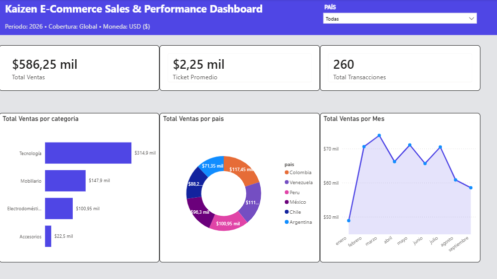
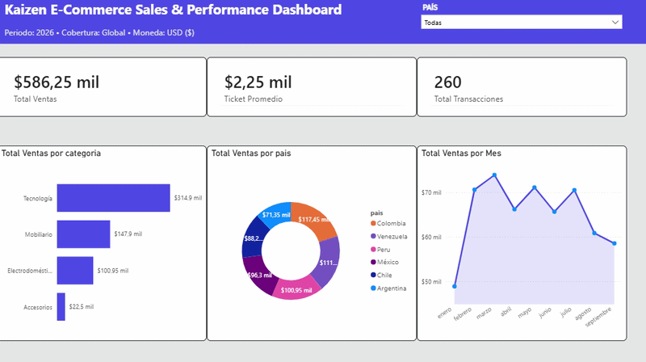

# 🛒 Kaizen E-Commerce Sales & Performance Analysis

An **End-to-End Data Analytics Project** transforming raw transactional e-commerce data from a relational SQLite database into a polished, high-impact executive dashboard in Power BI.



---

## 📽️ Interactive Demo



---

## 📌 Executive Summary & Key Insights

This project addresses the need for actionable business intelligence within an international e-commerce platform. By converting transactional records into business metrics, the executive dashboard enables stakeholders to track growth, regional behavior, and product category performance.

* **Revenue Growth Trend:** Steady revenue progression from Q1 through Q3 2026, featuring a strong sales peak in June ($20K+ USD).
* **Geographic Breakdown:** Regional coverage across 6 Latin American markets (Colombia, Venezuela, Peru, Mexico, Chile, and Argentina).
* **Category Drivers:** *Technology* and *Furniture* represent over 70% of total revenue volume.

---

## 🛠️ Data Architecture & Tech Stack

* **Database:** SQLite (`portfolio_ecommerce.db`) — Querying, data extraction, and relational schema structuring.
* **ETL & Data Transformation:** Power Query — Data cleaning, data type casting, and structural normalization.
* **Data Modeling:** Power BI Desktop — Implementation of an optimized **Star Schema**.
* **Analytics & DAX:** Custom explicit measures for key performance indicators (KPIs).
* **UI/UX Design:** Custom *AURA Design System* (Executive Light SaaS aesthetic with Indigo primary theme).

---

## 📐 Data Model (Star Schema)

The data model was structured following best dimensional modeling practices to maximize report performance and dynamic filtering:

+-------------------+             +-------------------+
  |   dim_clientes    |             |   dim_productos   |
  +-------------------+             +-------------------+
  | cliente_id (PK)   |             | producto_id (PK)  |
  | nombre            |             | nombre_producto   |
  | pais              |             | categoria         |
  +---------+---------+             +---------+---------+
            |                                 |
            | 1                               | 1
            |                                 |
            +----------------+----------------+
                             |
                             | *
                    +--------+--------+
                    |   fact_ventas   |
                    +-----------------+
                    | venta_id (PK)   |
                    | cliente_id (FK) |
                    | producto_id (FK)|
                    | fecha           |
                    | monto           |
                    +-----------------+

---

## 📊 Business Logic & DAX Measures

All metrics were dynamically calculated using explicit DAX measures with explicit currency formatting:

```dax
// Total Revenue Metric
Total Ventas = SUM(ventas[monto])

// Total Transactions Count
Total Transacciones = COUNTROWS(ventas)

// Average Order Value (AOV)
Ticket Promedio = DIVIDE([Total Ventas], [Total Transacciones], 0)
```

# 🎨 Design & User Experience Features
Unified Executive Header: Contextual metadata displaying operational scope (Period: 2026 • Coverage: Global • Currency: USD ($)) alongside an integrated country selection dropdown slicer.

AURA Card Components: Custom rounded white containers (#FFFFFF) with subtle borders over a soft light-gray canvas background (#F3F4F6) for modern visual hierarchy.

Cross-Filtering & Drill-Down: Dynamic chart interactions allowing instant breakdown of metrics across product categories, regional share, and monthly revenue trajectory.
